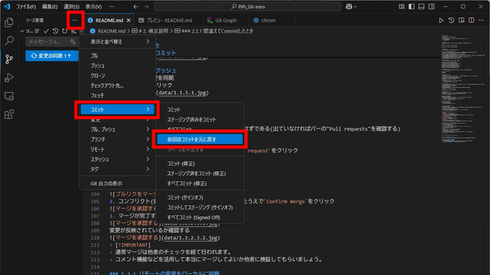
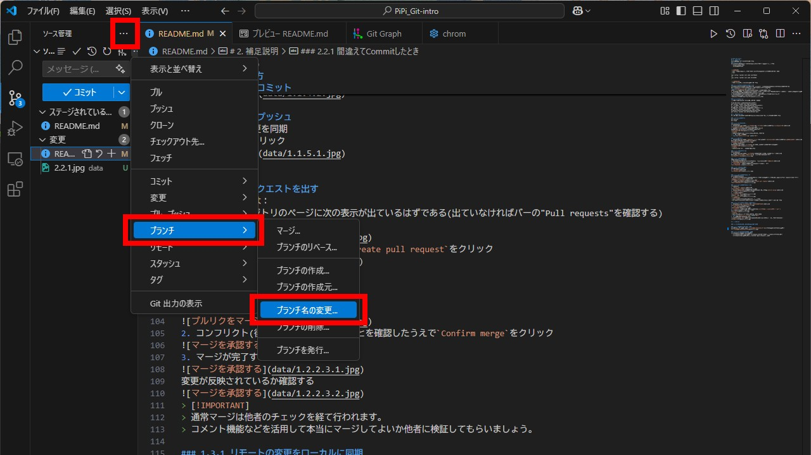

# PiPi_Git-intro

## 目次

 - [はじめに](#0-はじめに)
    - [事前設定](#01-事前設定)
    - [GitHubリポジトリのクローン](#021-githubリポジトリのクローン)
    - [Gitの設定](#022-gitの設定)
 - [開発の進め方](#1-開発の進め方)
    - [便利な拡張機能](#10-便利な拡張機能)
    - [ブランチの発行](#111-ブランチの発行)
    - [編集する](#112-編集する)
    - [変更をステージ](#113-変更をステージ)
    - [変更をコミット](#114-変更をコミット)
    - [変更をプッシュ](#115-変更をプッシュ)
    - [プルリクエストを出す](#121-プルリクエストを出す)
    - [プルリクエストをマージ](#122-プルリクエストをマージ)
    - [リモートの変更をローカルに同期](#131-リモートの変更をローカルに同期)
 - [補足説明](#2-補足説明)
    - [CLIによる操作](#21-cliによる操作)
    - [間違えてcommitしたとき](#221-間違えてcommitしたとき)
    - [ブランチ名を間違えたとき](#222-ブランチ名を間違えたとき)
 - [おまけ](#3-おまけ)
    - [GitHubに上げたくない情報があるとき](#31-githubに上げたくない情報があるとき)


## 0. はじめに
今回の実習で使うものの準備をします！
### 0.1 事前設定
Git-GitHub講習会では事前に以下の環境が整っている前提で進められる。
 - Visual Studio Code
 - GitHubアカウント


> [!WARNING]
> この資料では{}で括られているところは自分の情報に合わせて書き換えてください  
> 例：
> ```
>git config --global user.name {userName}
>↓
>git config --global user.name chron9103
> ```

> [!IMPORTANT]
> 何か問題が起きたら気軽に相談しましょう！

### 0.2.1 GitHubリポジトリのクローン
リポジトリとは：ファイルを保存する入れ物(フォルダ)のこと。具体的には変更履歴を保存している。  
  
今から現在閲覧しているGitHubリポジトリをローカルにコピー(クローン)する。 
1. GitHubで作成したリポジトリのページにて`<>Code > HTTPS`を選択し、URLをコピー (赤丸の箇所をクリックでコピーできる)  

2. VSCodeを開いて`Gitリポジトリのクローン` > 先のURLをペーストし"Enter"を押す  


### 0.2.2 Gitの設定
ターミナルで以下のコマンドを実行する。
```
# ユーザー名の設定。GitHubのIDがおすすめ
git config --global user.name {userName}
# メールアドレスの設定。GitHubと同じものがおすすめ
git config --global user.email {userEmail}
# コミットメッセージをVScodeで書けるようにする設定
git config --global core.editor 'code --wait'
# デフォルトのブランチをmasterからmainに変更。
git config --global init.defaultBranch main
```
## 1. 開発の進め方
これから実際にファイルを編集して、その変更を他の人も見れるようにしていきます！

### 1.0 便利な拡張機能
Git History
Git Graph

### 1.1.1 ブランチの発行
ブランチとは：メインから分岐して開発をする機能  
メインのコードに影響を与えず、新機能の追加やバグ修正を行い、問題がなければ統合する。
 
1. VSCodeの左部バーにある`ソース管理`から`ブランチ`をクリックして、`ブランチの作成`をクリック

2. 新しく作るブランチの名前を入力して"Enter"を押す  
ここでの名前は"selfIntro_{userName}"を推奨する

> [!NOTE]
> ウインドウ左下部に現在のブランチが表示されています。 
> 反映されていたら成功  
>  

### 1.1.2 編集する
1. VSCodeの左部バーにある`エクスプローラー`からファイル`lectures>2025`をクリックして、`新しいファイル`をクリック  
クリック後自分の名前のファイルを作成する

2. ファイルを編集する  
VSCodeの左部バーにある`ソース管理`に変更したファイルが書いてあるはずである

> [!NOTE]
> 例に倣って名前と一言を書いてみましょう！  

### 1.1.3 変更をステージ
ステージとは：変更内容を登録  
 
1. VSCodeの左部バーにある`ソース管理`に書いてある変更したファイルの`+`をクリック  
クリック後`ステージされている変更`に加わっていることを確認する


### 1.1.4 変更をコミット
コミットとは：変更を記録  
  
1. 入力欄に変更内容(今回は"自己紹介を追加"など)を明記して`コミット`をクリック

2. `Branchの発行`をクリックしてブランチをリモートに反映する


### 1.1.5 変更をプッシュ
プッシュとは：変更を同期  
  
1. `プッシュ`をクリック  


### 1.2.1 プルリクエストを出す
プルリクエストとは：  
1. GitHubのリポジトリのページに次の表示が出ているはずである(出ていなければバーの"Pull requests"を確認する)  
`Compare & pull request`をクリック

2. タイトル、本文に変更内容を明記して`Create pull request`をクリック


### 1.2.2 プルリクエストをマージ
マージとは：
1. `Merge pull request`をクリック

2. コンフリクト(後述)が発生していないことを確認したうえで`Confirm merge`をクリック

3. マージが完了する

変更が反映されているか確認する

> [!IMPORTANT]
> 通常マージは他者のチェックを経て行われます。  
> コメント機能などを活用して本当にマージしてよいか他者に検証してもらいましょう。

### 1.3.1 リモートの変更をローカルに同期
1. VSCodeに戻り、`ソース管理`から`チェックアウト先`をクリック

2. `main`ブランチに切り替える

3. `変更の同期`をクリック (表示がない場合は`ソース管理 > その他の操作 > プル`)  
リモートの変更点をローカルに反映する

> [!NOTE]
> 次のような表示が出てもOKを押して続行して問題ありません。  
>  
4. 同期できていることを確認する  
現在のブランチが`main`であること(左下に表示あり)、変更点が反映されていることを確認


## 2. 補足説明

### 2.1 CLIによる操作
これまでVSCode上のボタン操作によりGit(GitHub)の操作を行いましたが、各操作にはコマンドが用意されておりそれに対応するようにボタンが設置されている。コマンドを打ち込むことにより操作することを"CLI"と言う。
```
# gitの初期化
$ git init
# クローン
$ git clone https://github.com/hoge/fuga.git
# ブランチの発行
$ git switch -c "hogehoge"
# 変更をステージ
$ git add . 
# 変更をコミット
$ git commit -m "fugafuga"
# 変更をプッシュ
$ git push origin "hogehoge"
# リモートの変更をローカルに同期
$ git merge <commit>
```
今回紹介した以外にも多数のコマンドがあるので興味があれば各自調べるように。

### 2.2.1 間違えてCommitしたとき
プッシュを行う前であれば、`前回のコミットを元に戻す`を押すことで取り消すことができる


### 2.2.2 ブランチ名を間違えたとき
`ブランチ名の変更`で名前を変更できる
 - ブランチを削除すると削除したブランチの変更内容も消えるため、やり直す必要がある
 - ブランチの削除ができなかったら別の名前でブランチを作ればOK



## 3. おまけ

### 3.1 GitHubに上げたくない情報があるとき
Gitはデフォルトでは管理するディレクトリ以下の全てのファイルの変更を追跡する。  
しかし実際の開発ではGitに追跡されると困るもの、追跡する必要がないものがある場合がある。
このようなときにGitに無視する(追跡しない)よう指定するのが`.gitignore`である。
> [!TIP]
> `.gitignore`に入れるもの
>  - リモートに上がると困るもの
>       - 機密情報,個人情報が書かれたファイル
>  - リモートに上げる必要がないもの
>       - 依存関係のファイル(node_modulesなど)
>       - 自動生成されるファイル (追跡する場合もある)

```
# 特定のファイルを無視する
/hoge/file

# 特定のディレクトリを無視する
/hoge/directory/

# 特定の拡張子のファイルを無視する
*.txt
```
詳しくは公式テンプレート(https://github.com/github/gitignore)参照。


